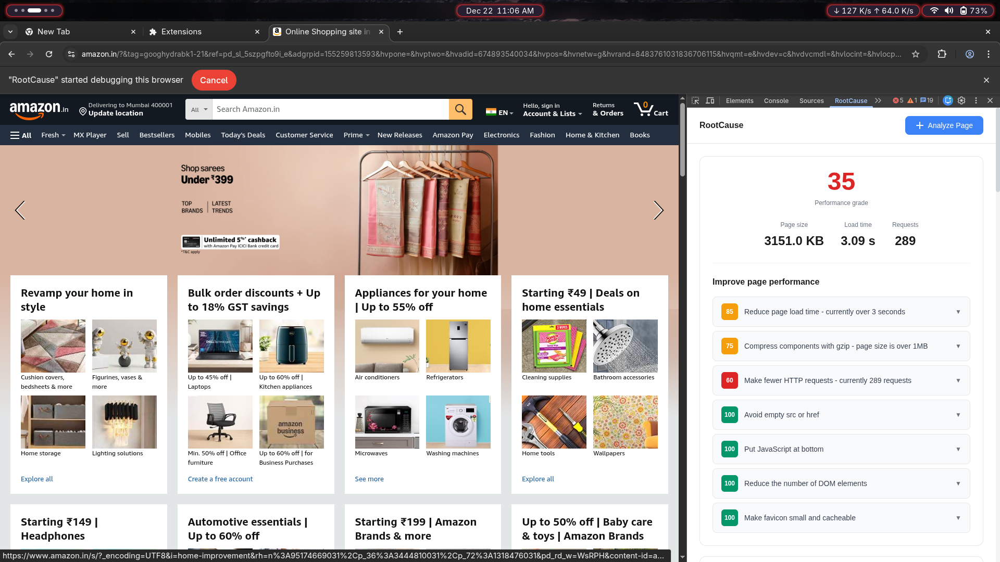

# RootCause - Performance Detective 🔍

A Chrome DevTools extension that explains **WHY** your website is slow in plain English, not just WHAT is wrong. Get root-cause narratives with actionable fixes.

## Screenshots

### DevTools Panel - Performance Analysis

*Performance analysis showing actionable insights with priority scores*

### Performance Metrics Overview

*Clear metrics: page size, load time, requests, and performance grade*

### Root Cause Explanations

*Human-readable explanations with specific recommendations*

> **Note:** To add your screenshots, place PNG/JPG images in the `screenshots/` directory with these names:
> - `analysis-panel.png` - Full panel view with analysis results
> - `metrics-overview.png` - Performance metrics display
> - `root-cause-details.png` - Detailed explanation view

## Features

- 🎯 **Root Cause Analysis**: Explains the "why" behind performance issues
- 📊 **Priority Engine**: Prioritizes fixes by impact (Critical, Optimization, Micro-Win)
- 🔗 **Dependency Tracing**: Tracks how issues cascade and affect each other
- 📝 **Human-Readable Narratives**: No jargon, just clear explanations
- ⚡ **Real-Time Analysis**: Analyze any webpage directly from DevTools

## Quick Start

### Installation

1. Clone this repository:
```bash
git clone <your-repo-url>
cd Extenction
```

2. Load the extension in Chrome:
   - Open Chrome and navigate to `chrome://extensions/`
   - Enable "Developer mode" (toggle in top-right)
   - Click "Load unpacked"
   - Select the project directory

### Usage

1. Open Chrome DevTools (F12 or right-click → Inspect)
2. Navigate to the "**RootCause**" tab
3. Click "**Analyze Page**" button
4. Review the analysis results organized by priority

## Project Structure

```
.
├── background/           # Background service worker
│   ├── service-worker.js
│   └── firefox-background.js
├── core/                 # Core analysis engines
│   ├── analyzer.js
│   ├── dependency-tracer.js
│   ├── human-translator.js
│   └── priority-engine.js
├── devtools/            # DevTools integration
│   ├── devtools.html
│   ├── devtools.js
│   └── panel/           # Analysis panel UI
│       ├── panel.html
│       ├── panel.css
│       └── panel.js
├── popup/               # Extension popup
│   ├── popup.html
│   └── popup.js
├── icons/               # Extension icons
├── screenshots/         # Project screenshots for README
├── scripts/             # Build and utility scripts
├── docs/                # Documentation
├── manifests/           # Browser-specific manifests
│   ├── manifest-firefox.json
│   └── manifest-edge.json
├── manifest.json        # Chrome extension manifest
└── package.json         # Project metadata

```

## Development

See [docs/DEVELOPMENT.md](docs/DEVELOPMENT.md) for detailed development guidelines.

### Building for Multiple Browsers

Run the build script to create browser-specific packages:

```bash
./scripts/build.sh
```

This generates optimized builds in the `build/` directory for:
- Chrome
- Firefox
- Edge
- Safari

## Cross-Browser Support

This extension supports multiple browsers. See [docs/README_CROSS_BROWSER.md](docs/README_CROSS_BROWSER.md) for browser-specific instructions.

## Documentation

- [Architecture](docs/ARCHITECTURE.md) - System design and architecture
- [Development Guide](docs/DEVELOPMENT.md) - Development setup and guidelines
- [Testing Guide](docs/TESTING.md) - Testing procedures
- [Enhanced Features](docs/ENHANCED_FEATURES.md) - Advanced features and capabilities
- [Quick Start](QUICKSTART.md) - Get started in 2 minutes

## Contributing

Contributions are welcome! Please read our contributing guidelines before submitting PRs.

## License

MIT License - see [LICENSE](LICENSE) file for details

## Author

Yashraj

## Changelog

See [CHANGELOG.md](CHANGELOG.md) for version history and release notes.
